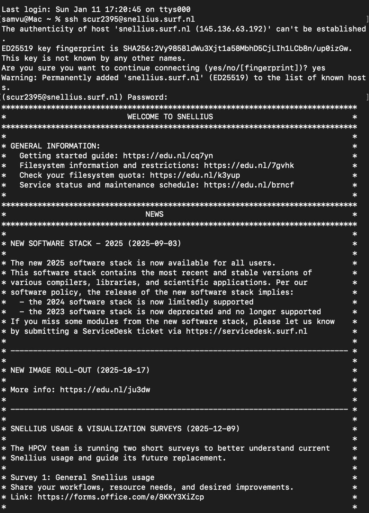
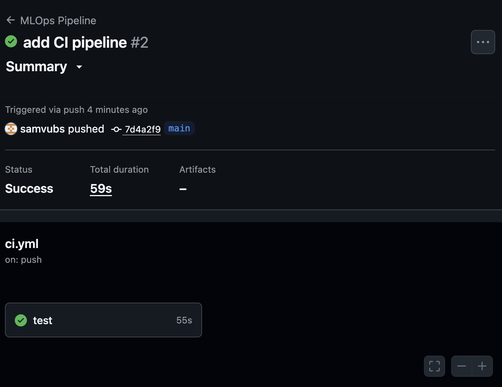
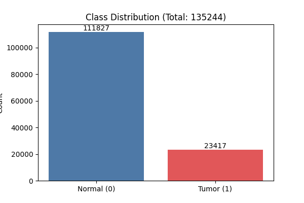
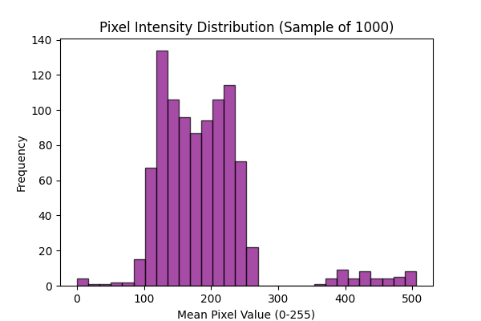
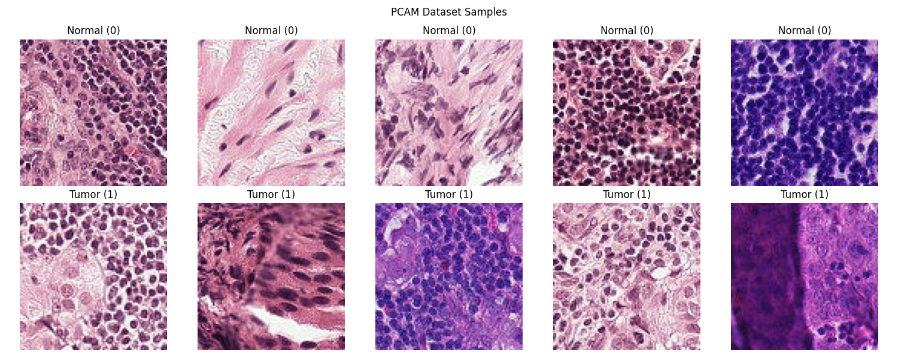

# Assignment 1: Setup & Debugging Journal
**MLOps & ML Programming (2026)**

## Student Information
* **Name:** Sam Vu
* **Student ID:** 15623211
* **TA Name:** J.W.J. Hutter
* **GitHub Repository:** https://github.com/samvubs/MLOps_2026#
* **Base Skeleton Used:** [https://github.com/SURF-ML/MLOps_2026/tree/main](https://github.com/SURF-ML/MLOps_2026/tree/main)

---

# Question 1: First Contact with Snellius

1. **Connection Details**
   - **Command:** `ssh scur2395@snellius.surf.nl`
   - **Login Node:**  int6
   - **Screenshot:** 

2. **Issues Encountered:**
   - **Error Message:** `The authenticity of host 'snellius.surf.nl (145.136.63.192)' can't be established.`
   - **Resolution:** 
    1. I identified that this was not a connection refused error but just a standard SSH security protocol for first-time connections.
    2. I typed `yes` to add the cluter to my `known_hosts` file.
    3. I then entered my password when prompted to complete the login.

---

3. **Smooth Connection (If applicable):**
   - **SSH Client:** (OpenSSH_10.0p2, LibreSSL 3.3.6)
   - **Prior Experience:** Webtech
   - **Preemptive Steps:** None that I actively took.

---

## Question 2: Environment Setup
1. **Setup Sequence:**
   - **Commands:** 
    12  module purge
    13  module load 2025
    14  module load Python/3.13.1-GCCcore-14.2.0
    15  module load matplotlib/3.10.3-gfbf-2025a
    16  python -m venv venv
    17  source venv/bin/activate
    18  pip install torch torchvision --index-url https://download.pytorch.org/whl/cu121
    19  python -c "import torch; print(f'PyTorch: {torch.__version__}'); print(f'CUDA available: {torch.cuda.is_available()}')"
   - **Full Venv Path:** `/gpfs/home3/scur2395/MLOps_2026/venv'

2. **Pip Install Torch:**
   - **Duration:** Approximately 2 minutes
   - **Warnings:** None
   - **Venv Size:** `4.3G	venv`

3. **Mistakes/Unexpected Behavior:**
While the installation went well the handbook notes that using venv over Conda is a specific strategy for Snellius. I guess a mistake would be using Conda in this environment because it creates small files that perform poorly on this filesystem. By using the 2025 moduel stack and a standard venv, I ensured that the heavy Python installation is managed by the system while my specific project libraries remain isolated.

4. **Verification:**
   - **Output:** `PyTorch: 2.5.1+cu121`
`CUDA available: False`
   - **Explanation:** Because we are running this on a Login Node, which is a shared node for interactive tasks like editing code and script management. These nodes do not have GPU hardware, to see it true I will have to submit the job to a GPU-accelarated compute node. The False is expected because I ran it on a login node `int6`. Per the Snellius Handbook, login nodes are for management and lack GPU accelarators.

---

## Question 3: Version Control Setup
1. **GitHub URL:** https://github.com/samvubs/MLOps_2026#
2. **Authentication:** SSH
3. **.gitignore:**
   - **Contents:** 
``` text
   __pycache__/
*.pyc
experiments/logs/
experiments/results/
.env
.DS_Store
*.egg-info/
```
   - **Important items to include:** 
   * `venv/`: You must ignore this because it contains gigabytes of external libraries that are platform-dependent and should not be versioned.
   * `data/` and `*.pt`: large datasets and model weights are "binary blobs" that bloat the repository and should be stored in specialized in storage, not Git.
   * `.env`: This file often contains sensitive API keys or secrets that should never be leaked to a public or shared repository
   - **README info:** Yes the README should document how to access Snellius and load specific modules like the 2025 stack. Without this, the "Quick Start" commands woudl fail because the system wouldn't know which Python version to use.
4. **Git Log:** aafcd55 (HEAD -> main, origin/main, origin/HEAD) updated readme.md
``` text
5ec32b3 Update gitignore and add initial journal questions
880d065 Merge pull request #2 from SURF-ML/example_script
d2187cb example lecture 2 week 1
81e4e92 Merge pull request #1 from SURF-ML/fix_tests_for_students
6dcc5e7 tests update correct format
ab45d42 better starting pyproject
f527672 data class, loader and model tests
6e98f69 proper imports and venv verification
d78dee2 minor add
2743d0a remove setup, not needed because we have pyproject
8a04023 Update README.md
11973fb initial commit for the folder structure
e8582f8 Initial commit
```

---

## Question 4: Your First Batch Job (Slurm)
1. **Files Provided:** 
* `gpu_check.job`
* `gpu_check_18243188.out`
2. **Job ID & Stats:** 
* Job ID: 18243188
* Stats: 
```text
JobID                      Start                 End    Elapsed      State 
------------ ------------------- ------------------- ---------- ---------- 
18243188     2026-01-11T21:08:15 2026-01-11T21:08:25   00:00:10  COMPLETED 
18243188.ba+ 2026-01-11T21:08:15 2026-01-11T21:08:25   00:00:10  COMPLETED 
18243188.ex+ 2026-01-11T21:08:15 2026-01-11T21:08:25   00:00:10  COMPLETED 
```
3. **Submission Problem:** 
* The Error: `sact: error: Unknown arguments: -format.`
* Diagnosis: The command failed bcause of a character encoding issue where a "long dash" was used instead of a double-dash(--).
4. **Verification:** It works. It outputted `CUDA available: True` and `GPU: NVIDIA A100-SXM4-40GB MIG 1g.5gb`
5. **Login vs Batch:** Running on a Login Node like `int6` happens immdeiately on a management server that lacks GPU hardware, which is why the check said `False`. Submitting a Batch Job via Slurm puts the request in a queue and once it's my turn, Slurm gives me a dedicated Compute Node with an actual GPU, which is why the script finally returns `True`.
6. **Why Clusters?:** 
We use clusters because they provide parallel computing power that a laptop can't match. They offer hundreds of CPU cores, terabytes of RAM and high speed networking to move data between nodes quickly. For MLOps, the most important part is access to like high level grade GPUs which have more VRAM than normal cards so models can train on huge datasets much faster.

---

## Question 5: Reflection & Conceptual Understanding
1. **The Filesystem:**
   - **I/O Performance:** 100k small files is bad because it causes a metadata bottleneck. Each file access requires metadata lookups which overwhelms the systems IOPS capacity. This is especially bad in ML because we randomly sample data, making it impossible for the ysstem to "predict" and pre-load the files.
   - **Mitigation Strategies:** 
   * Strategy 1: HDF5 containers: Store images in one big "shipping container". This stops the computer from wasting time doing "paperwork" (metadata) for 100,000 individual images and just reads it instantly of one big file with the 100,000 images.
   * Strategt 2: Local Scratch Storage: We copy this shipping container from the server to the Local Scratch inside our specific compute node so the GPU can grab data instantly.
   - **Dataset Versioning:** We cannot use Git for datasets in the GB or PB range because Git is optimized for text and struggles with large binary blobs, which makes the repository unmanageably slow. Instead we use DVC. DVC stores the actual heavy data in a seperate remote storage and places a tiny 'pointer' or 'receipt' file in Git. This allows us to track which version of the data we used without bloating our code repository.
2. **Reproducibility:** 
* Dependency Drift: Different versions of libraries perform math differently. We can fix that by pinning: using a `pyproject.toml` or `venv` to lock in the exact versons of every library used.
* Stochasity (Randomness): Different random weight initialization at the start of training can produce different outcomes. By seeding: setting a global random seed will produce identical randomness across runs.
* Hardware Non-determinism: Tiny differences in hwo GPUs vs CPUs handle floating-point decimal precision. Logging the specific hardware to account for hardware-specific numeral behavior avoids confusion.
3. **Conda vs venv vs uv:** [Pros/Cons of each for Snellius]
* Conda
    * Pros: Great for messy projects that need weird non-Python tools and lets you install your own version of everything without asking permission.
    * Cons: Bad for on Snellius because it creates thousands of small files that choke the GPFS filesystem and can often break the GPU drivers.
* Python venv
    * Pros: Perfect for Snellius: it's standard, stable and works natively with the 2025 modules provided.
    * Cons: It can only manage Python libraries and no complex non-python software like drivers. Plus you have to manually remember which `module load` commands you used every time you log back in.
* Astral uv
    * Pros: It's 10-100x faster at installing libraries and uses a "Lockfile" to ensure everyone has the same setup.
    * Cons: It's a bit newer so there's a small learning curve for the different commands. It's not standard either so you might have to re-install uv itself if the system gets updated.

---

## Question 6: Package Integrity
1. **ModuleNotFoundError:** I ran an editable install linking my source code to venv's site packages. I initially encountered a series of ModuleNotFoundError for libs. I manually installed those but then I realized, that should not be how it works. So i looked at the pyproject.toml and saw it needed to refer to requirements.txt so I just copy and pasted those into the file. So i did ecnounter `ModuleNotFoundError` (and a shell `command not found` for pytest), but it was not due to a PYTHONPATH or __init__.py.

    Also when I ran `pip install -e .` I received a `TOMLDecodeError` because I had forgotten to use quotes and commas in my pyproject.toml dependencies list. This prevented the ml_core package from being installed into my venv.
2. **Import Abstraction:** Abstraction. If you change the filename later you only have to update the init (like receptionist). Instead of updating every single file in the project to update the path.
3. **Pytest Result:** 
<pre>
(venv) scur2395@int4:~/MLOps_2026$ pytest tests/test_imports.py
============================== test session starts ==============================
platform linux -- Python 3.9.21, pytest-8.4.2, pluggy-1.6.0
rootdir: /gpfs/home3/scur2395/MLOps_2026
configfile: pyproject.toml
collected 1 item                                                                

tests/test_imports.py .                                                   [100%]

=============================== 1 passed in 5.80s ===============================
</pre>

---

## Question 7: The Data Pipeline
1. **Implementation:** 
<pre>
    def __getitem__(self, idx: int) -> Tuple[torch.Tensor, torch.Tensor]:
        # Read specific index
        # Map the dataloader's index (0...97) to the actual file index (e.g., 0, 3, 4...)
        real_idx = self.indices[idx]

        image = self.x_data[real_idx]     # <--- Use real_idx
        label = self.y_data[real_idx][0]  # <--- Use real_idx

        # Ensure uint8 for PIL compatibility
        image = image.astype(np.uint8)
        
        if self.transform:
            image = self.transform(image)
            
        return image, torch.tensor(label, dtype=torch.long).squeeze()
</pre>
2. **Local Pytest:** When running the test initially, I encountered three main failures.
   1. FileNotFoundError / Key Errors:
      * The error: The code copy-pasted from the PDF contained formatting problems specifically extra spaces in filenames `" cam elyon . . ."` and dictionary keys (e.g., `" batch_size "`).
      * The Fix: I cleaned up the strings in `loader.py` to match the exact filenames on disk and the keys in the configuration dictionary.
   2. The heuristic filter test failed
      * The error: The test expected the dataset to filter out broken images (pure black or white slides), but my `PCAMDataset` class was returning the full length instead of the filtered length.
      * The fix: I implemented filtering logic in `src/ml_core/data/pcam.py`. I added a loop in `__init__` to check the mean pixel values, stored valid indices in self.indices, and updated `__getitem__` to retreive data using this mapped index.
   3. The weighted sampling test failed
      * The error: The test expected the data loader t o balance the classes (showing more "Tumor" samples than "Normal"), but the initial implementation just used `shuffle=True`. This resulted in too few positive samples in the batch.
      * The fix: I updated `src/ml_core/data/loader.py` to calculate class weights based on the training data labels. I then did a `WeightedRandomSampler' with these weights to give it then to the DataLoader (setting shuffle=False).

<pre>
(venv) scur2395@int6:~/MLOps_2026$ pytest tests/test_data_loader.py
============================== test session starts ==============================
platform linux -- Python 3.9.21, pytest-8.4.2, pluggy-1.6.0
rootdir: /gpfs/home3/scur2395/MLOps_2026
configfile: pyproject.toml
collected 4 items                                                               

tests/test_data_loader.py ....                                            [100%]

============================== 4 passed in 10.69s ===============================
</pre>
3. **CI Pipeline:**
   - **Screenshot:** 
   - **Reflection:** Both worked
4. **Sampling Math:** Without the sampler there is a natural imbalance in the dataset. With the WeightedRandomSampler the probability of drawing a sample is proportional to its class frequencuy forcing a balanced distribution.
5. **EDA Plots:**
   - 
   -
   - 

---

## Question 8: Model Implementation (MLP)
1. **Forward Pass:** The correct input is 3x96x96. You get this by calculating the flattened size of the PCAM images. If i had used the wrong dimension I would get an error.
2. **Weight Updates:** Checking that the lossi s a number only confirms that the forward pass is working but does not guarantee the model is learning. So its important to verify that the weights actually update.
3. **Test Output:** 
<pre>
(venv) scur2395@int6:~/MLOps_2026$ pytest tests/test_model_shapes.py
============================== test session starts ==============================
platform linux -- Python 3.9.21, pytest-8.4.2, pluggy-1.6.0
rootdir: /gpfs/home3/scur2395/MLOps_2026
configfile: pyproject.toml
collected 2 items                                                               

tests/test_model_shapes.py ..                                             [100%]

============================== 2 passed in 11.05s ===============================
</pre>

---
## Question 9: Training Loop & Loss Visualization
1. **Training Execution:** Submitted jobs via Slurm (`sbatch train_job.sh`) and Node ID: `gcn9`
2. **Loss Visualization:**
   - **Plot:** 
   <pre>
   JobID             State ExitCode     MaxRSS 
------------ ---------- -------- ---------- 
18257481         FAILED      1:0            
18257625         FAILED      1:0            
18257625.ba+     FAILED      1:0      7106K 
18257625.ex+  COMPLETED      0:0            
18257723         FAILED      1:0            
18257723.ba+     FAILED      1:0      4911K 
18257723.ex+  COMPLETED      0:0            
18257757        TIMEOUT      0:0            
18257757.ba+  CANCELLED     0:15   1166323K 
18257757.ex+  COMPLETED      0:0            
18257791        TIMEOUT      0:0            
18257791.ba+  CANCELLED     0:15   1162112K 
18257791.ex+  COMPLETED      0:0            
18257954        TIMEOUT      0:0            
18257954.ba+  CANCELLED     0:15    984860K 
18257954.ex+  COMPLETED      0:0            
18259916         FAILED      1:0            
18259916.ba+     FAILED      1:0      3674K 
   </pre>

   I unfortunately was not able to generate a plot.
   - **Trajectory Analysis:** 
   I was unable to generate the loss plot because the training jobs consistently timed out or were terminated by the scheduler before completing the first epoch. Hypothesis: If the training had succeeded, I would expect the Training Loss to decrease strictly (as the MLP overfits the training data). The Validation Loss would likely decrease initially but then plateau or rise (diverge) as the simple MLP model begins to overfit, since we only used basic dropout and the PCAM dataset is complex
3. **Most Frustrating Error:**
   - **Error Message:** `State: TIMEOUT`
   `ExitCode: 0:0`
   `(Job cancelled due to time limit)`
   - **Debugging Steps:** 
   My jobs were consistently killed by the Slurm scheduler on the gpu_course partition, likely due to the strict resource constraints (16GB RAM limit and short wall-times).

    I attempted to resolve this by iteratively optimizing the resource usage:

        Reduced Overhead: Set num_workers=0 in config.yaml to avoid multiprocessing memory spikes.

        Lowered Batch Size: Reduced batch_size from 128 to 64, and finally to 32 to fit within the memory slice.

        Increased Time: Requested the maximum time allowed for the partition (00:45:00).

        Sanitized Data: Added np.nan_to_num in the Dataset class to prevent potential numerical crashes.

    Despite these optimizations, the I/O bottleneck of reading thousands of small files from the shared /scratch-shared/ filesystem likely caused the data loading to be too slow for the allocated time.

---