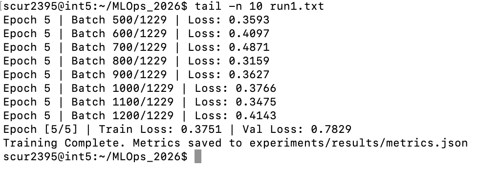
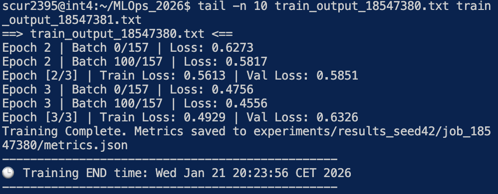
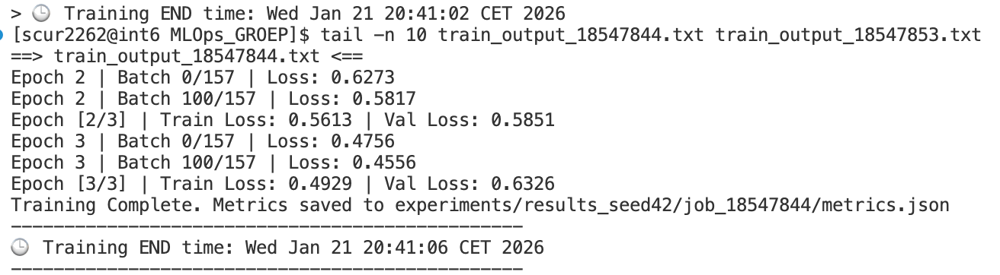
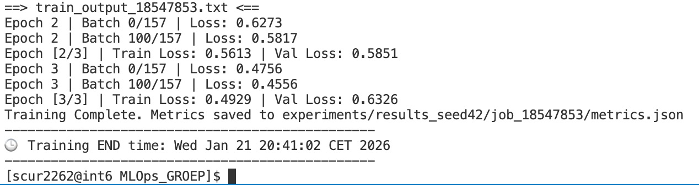
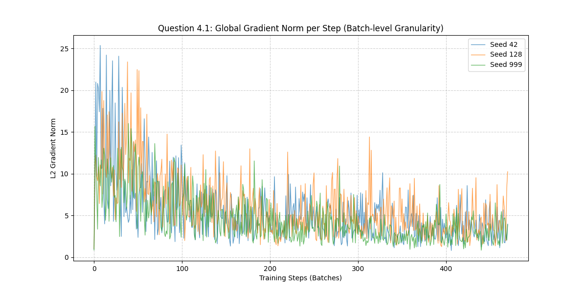
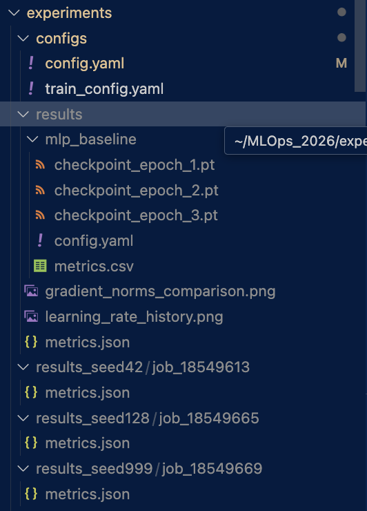
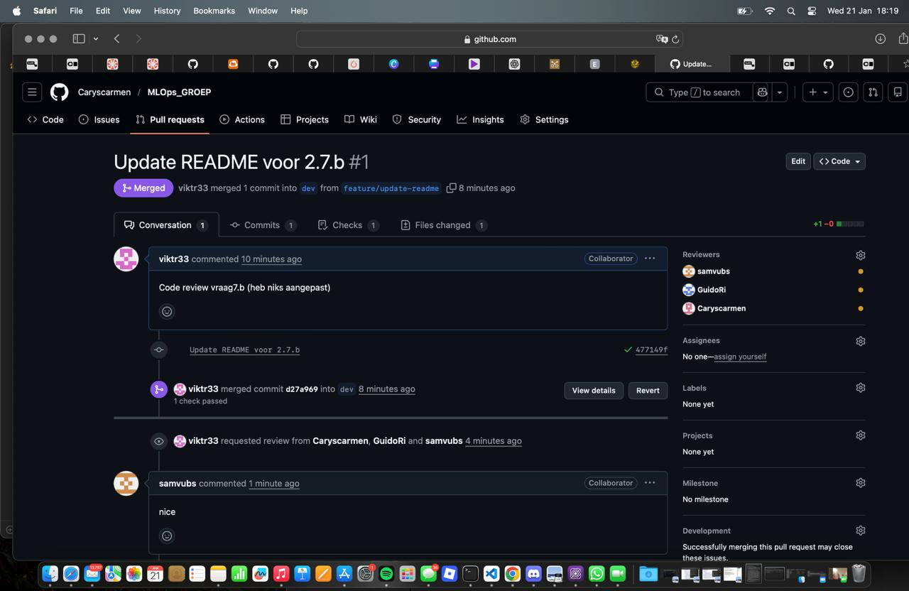
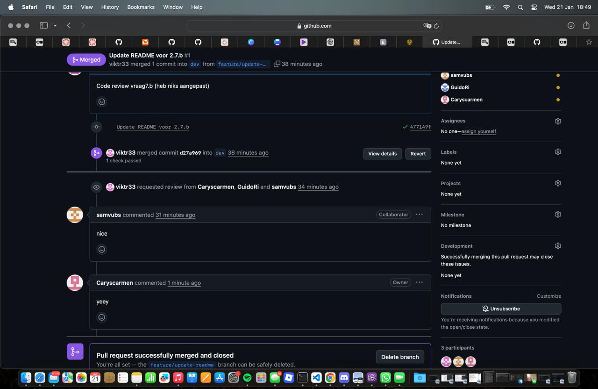
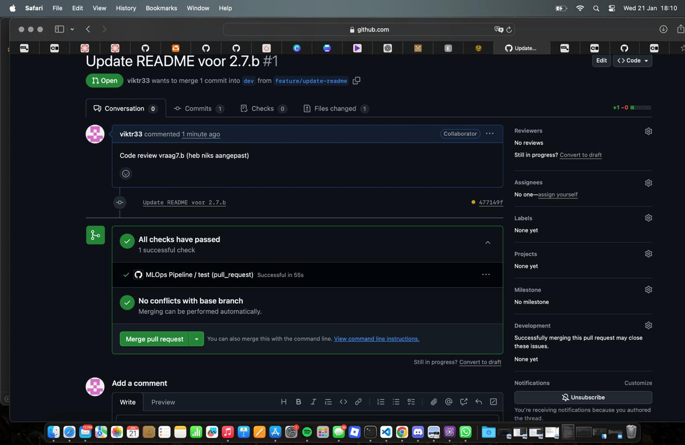
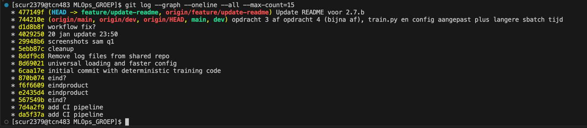

# Assignment 2: MLOps & PCAM Pipeline Journal
**MLOps & ML Programming (2026)**

## Group Information
* **Group Number:** 38
* **Team Members:** Sam Vu 15623211, Carys Augustine 15614972, Aye Taky 15552853, Guido Rienks
* **GitHub Repository:** https://github.com/Caryscarmen/MLOps_GROEP.git
* **Base Setup Chosen from Assignment 1:** Sam Vu

---

* Note on AI Usage
We used Gemini, Claude, and GPT-4 as basically a tutor or a second set of eyes throughout this project. It’s hard to figure out the specific quirks of a cluster like Snellius on your own, so we used them to help understand the assignment requirements, learn how to write the SLURM scripts, and figure out how to structure the YAML config files. We also used them to debug weird PyTorch errors and clean up our grammar in the report. We didn't just copy-paste whatever they said; we used them to actually learn the "why" behind things like seeding and data loading so we could explain it ourselves during the oral exam.

## Question 1: Reproducibility Audit
1. **Sources of Non-Determinism:**
* GPU Algorithms: 
   * Non-deterministic behavior in CuDNN's convolution algorithm, which trade strict order of operations for computational speed. By default you add numbers in order you hear them but because of how computers handle decimals (floating point math), A + B + C might give a tiny bit different result than C + A + B. 
* Shuffling vs. Sampling:
   * The `WeightedRandomSampler` in `loader.py` introduces randomness by probabillistically selecting samples to balance the class dsitributions. Unlike a standard shuffle this sampler biases the selection to pick rare cases more frequently.
* Random model-initialization: 
   * Without a fixed seed the hidden layers in the MLP are initialized with  different random weights each run.
* Library seeds: 
   * Python's `random` module and `numpy` generate pseudo-random numbers which causes data processing results to vary if not seeded.

2. **Control Measures:**
* GPU Algorithms:
   * Currently Controlled? Yes
   * How is it controlled?
      * By setting `torch.backends.cudnn.deterministic = True` and `benchmark = False`, we force CuDNN to use deterministic algorithms, ensuring the same order of operations every time.
* Shuffling vs. Sampling:
   * Currently Controlled: Yes
   * How is it controlled:
      * The `WeightedRandomSampler` relies on PyTorch's rando number generator. We control this by setting the PyTorch seed (`torch.manual_seed`) in our `set_seed` function.
* Model Initialization
   * Currently Controlled: Yes
   * How is it controlled:
      * We call `torch_manual_seed()` before initializing the model. This ensures PyTorch generates the exact same starting weights for the MLP layers in every run.
* Library Seeds
   * Currently Controlled: Yes
   * How is it controlled:
      * We explicitly set the seeds for external libraries using `random.seed(seed)` and `np.random.seed(seed)` to ensure any auxiliary data processing is consistent.

3. **Code Snippets for Reproducibility:**
   ```python
   # Paste the exact code added for seeding and determinism
   def set_seed(seed): """Zet alle seeds vast voor volledige reproduceerbaarheid.""" 
      random.seed(seed) 
      np.random.seed(seed) 
      torch.manual_seed(seed) #… non-determinism op bij model initialisatie.
      torch.cuda.manual_seed(seed) 
      torch.cuda.manual_seed_all(seed)

      #… het vastzetten van de gpu gedrag, door PyTorch te dwingen om 		altijd hetzelfde pad te kiezen.

      torch.backends.cudnn.deterministic = True 
      torch.backends.cudnn.benchmark = False 
      print(f"Reproducibility: Seed ingesteld op {seed}")
   ```

4. **Twin Run Results:**

| User | Run # | Final Train Loss | Final Val Loss | Result |
| :--- | :---: | :--- | :--- | :--- |
| **Sam** | 1 | 0.4929 | 0.6326 | — |
| **Sam** | 2 | 0.4929 | 0.6326 | ✅ Match |
| **Carys** | 1 | 0.4929 | 0.6326 | ✅ Match |
| **Carys** | 2 | 0.4929 | 0.6326 | ✅ Match |
| **Aye** | 1 | 0.4929 | 0.6326 | ✅ Match |
| **Aye** | 2 | 0.4929 | 0.6326 | ✅ Match |

Sam



Carys



### 2. Leakage Prevention

To prevent data leakage, we ensure that information from the test set does not influence the training process. Specifically:

- **Normalization:** We calculate the mean and standard deviation only on the **training set**. These fixed values are then applied to normalize the validation and test sets during the inference/evaluation phase.
- **Data Augmentation:** All transformations (such as flipping or rotation) are applied strictly to the training pipeline and never to the validation or test sets.

### 3. Cross-Validation Reflection

While K-Fold Cross-Validation is excellent for small datasets to reduce variance, it is not suitable for the PCAM dataset in this environment. Given that the training set exceeds 150,000 images and deep learning models take significant time to converge on the Snellius GPUs, the computational cost of training $K$ models would be prohibitive. Instead, a fixed **Hold-out** strategy (Train/Val/Test) is used for efficient hyperparameter optimization.

### 4. The Dataset Size Mystery

We observed that our `camelyonpatch_level_2_split_train_x.h5` file is disproportionately large (approximately 17GB) compared to the original 6GB full PCAM dataset.

- **Finding:** Upon inspection using `h5py`, we discovered that the `Compression Type` is `None`.
- **Reason:** The original PCAM dataset uses internal HDF5 compression (such as GZIP or LZF). Our subset stores raw pixel values ($96 \times 96 \times 3$ per image). This lack of compression results in a much larger footprint on the Snellius disk despite having fewer samples.

### 5. Poisoning Analysis

Our inspection of the training samples (saved in `assets/poisoning_check.png`) revealed evidence of a **Backdoor/Trigger Attack**.

- **Observation:** Visual analysis of several samples showed consistent artificial artifacts—specifically small, high-contrast pixel blocks (triggers) in the images.
- **Impact:** This is a form of poisoning where the model might learn to associate the artificial trigger with a specific label rather than learning the actual biological features of the tissue.

---

## Question 3: Configuration Management
1. **Centralized Parameters:**
The following five parameters were identified as critical variables that should not be hard-coded:
* Learning Rate: This controls the step of the optimizer
* Batch Size: Determines how many images are processed simultaneously.
* Epochs: The number of times the model processes the entire dataset.
* Hidden Units: Defines the model architecture of the MLP.
Data Path: Specifies the location of the PCAM files on the Snellius server.

2. **Loading Mechanism:**
   - We used a YAML-based configuration management to begin with.

   * Configuration File (`config.yaml`): The parameters are stored in a structured YAML format.
   ```python
   data:
      data_path: "/scratch-shared/scur2395/surfdrive"
      batch_size: 128
      num_workers: 2
      filter_train: True
      filter_val: False
      normalization:
         mean: [0.5, 0.5, 0.5]
         std: [0.5, 0.5, 0.5]
      sampler:
         replacement: True
      shuffle_val: False

   model:
      name: "mlp"
      input_shape: [3, 96, 96]
      num_classes: 1
      hidden_units: 128

   training:
      epochs: 5
      learning_rate: 0.001
      log_interval: 100
      save_dir: "experiments/results"
   ```
   * Loading in `train.py`: We use `yaml.safe_load` to inject these values into the script at runtime. This allows the code to adapt without manual editing:
   ```python
   def main(config_path):
      # 1. Load Config
      with open(config_path, "r") as f:
         cfg = yaml.safe_load(f)
   
      ## example of loaded parameters:
      optimizer = optim.Adam(model.parameters(), lr=cfg['training']['learning_rate'])
      epochs = cfg['training']['epochs']
   ```

   * loader.py Integration: Instead of fixed booleans, the DataLoader now queries the YAML configuration
   ```python
   ## example of loaded parameters:
   train_loader = DataLoader(
        train_ds, 
        batch_size=data_cfg["batch_size"], #1
        sampler=sampler,
        shuffle=False,
        num_workers=data_cfg["num_workers"], #2
        worker_init_fn=seed_worker,   #3
        generator=g
    )
    
    val_loader = DataLoader(
        val_ds, 
        batch_size=data_cfg["batch_size"], #4
        shuffle=data_cfg["shuffle_val"], #5
        num_workers=data_cfg["num_workers"], #6
        worker_init_fn=seed_worker,  
        generator=g
    )
   ```
   

3. **Impact Analysis:**
* Reproducibility: Isolating configuration in a seperate file allows us to track which settings produced a specific result.
* Experiment Comparison: Comparing different runs is now a matter of comparing YAML files rather than searching through source code.
* Collaboration: Teammates can run the code on  their own accounts by changing a single line in `config.yaml` instead of editing `train.py`, reducing bugs and conflicts.

4. **Remaining Risks:** 
* With configuration management there are still some risks:
* Software Environment: YAML does not track versions of libraries like TORCH or CUDA which can cause discrepancies
* Data Integrity: The config points to a path but cannot guarantee the data there has not been modified or corrupted.
* Human Error: Standard YAML files are vulnerable to mistakes like typos.

---

## Question 4: Gradients & LR Scheduler
1. **Internal Dynamics:**

   1.1.
   * High Stochasticity: The plot displays the gradient norm for every batch rather than an average over the entire epoch. The high granularity reveals significant high-frequency noise, with the norm fluctuating rapidly.
   * Stability Insight: If we plotted per epoch we would see a more smooth downward curve but the stepwise plot proves that the training is locally unstable. The high variance indicates that the loss landscape is not smooth; some batches provide a strong, clear signal while others (randomly sampled) pull the model in different directions. This confirms the training is working (overall trend is down) but relies on the "law of large numbers" to average out the noise from unstable individual batches.

   1.2.
   * Observation: There are distinct spikes where the gradient norm shoots up higher than the local average (e.g., spikes reaching >20 in the early steps or sudden jumps to >12 in later stages where the average is lower).
   *  Indication: These spikes typically indicate that there are outliers or "garbage" data within a specific batch.


2. **Learning Rate Scheduling:**

   2.1.
   * Scheduler: `ReduceLROnPlateu`
   * Justification: We chose this schedular because it adapts rather than staying fixed. Unlike `StepLR` (which decays on a fixed schedule regardless of performance), `ReduceLROnPlateau` keeps track of the Validation Loss. It only reduces the learning rate when the improvement stalls.

   This is effective for PCAM because medical image classification often involves a noisy landscape. A fixed scheduler might decay too early or too late. By using a "patience" mechanism. `ReduceROnPlateau` ignores temporary noise and only intervenes when optimization truly stagnates.

   2.2.
   * The problem (High LR): In the early stages of training, a larger learn rate is beneficial because it allows the optimizer to take large steps and descend the gradient rapidly. However, as the model weights approach the global minimum the gradients become smaller. If the learning rate remains high, the update steps will be too large relative to the curvature of the lsos function. This causes the model to overshoot the minimum and bounce back and forth (oscillate) around the target without ever setting in.

   * The Solution (Decay): By reducing the learning rate by a factor (e.g., 0.1 ) in the final stages we force  the model to take much more smaller and precise steps. The optimizer can then lessen oscillation and fine-tune weights.

   In our plot the learning rate remains constant at 10^-3 to maximize initial speed then drops to 10^-4 to facilitate this final fine-tuning phase.

---

## Question 5: Part 1 - Experiment Tracking
1. **Metrics Choice:**

* We selected ROC-AUC and the F2-Score with $\beta=2$.
* ROC-AUC is useful because it evaluates the model's ability to distinguish between classes across all possible probability thresholds. In medical diagnostics, it provides a holistic view of the classifier's performance without being biased by a single "cut-off" point.
* We chose $\beta=2$ to prioritize Recall over Precision. In cancer detection, a False Negative is significantly more dangerous than a False Positive. The $F_2$-score mathematically weights the model to ensure we catch as many positive cases as possible.


2. **Results (Average of 3 Seeds):**
'''bash
Average ROC-AUC: 0.7485 (std: 0.0154)
Average F2-Score: 0.6698 (std: 0.0734)
'''
Relatively high standard deviation in the F2-score (0.07) compared to ROC-AUC suggests that while the ranking ability is stable, its performance at the specific decision treshold varies significantly between random seeds. Needs treshold tuning or other methods.

3. **Logging Scalability:**
Ad-hoc logging (using print statements or naming files manually) works for single runs but fails at scale because it does not have structure or queryability.
   1. It does not have history. Console logs are transient; once the terminal closes the history is lost or buried.
   2. You cannot easily compare.
   3. Ad-hoc methods rarely capture full context which makes it hard to reproduce

4. **Tracker Initialization:**
* Our training code initializes the tracker once at the start and interacts with it through a clean API, keeping the training logic separate from the logging logic:
   ```python
   # Snippet showing tracker/MLFlow/W&B initialization
   # Checkpoint dictionary
        checkpoint = {
            "epoch": epoch,
            "model_state_dict": model.state_dict(),
            "optimizer_state_dict": optimizer.state_dict(),
            "train_loss": avg_train_loss,
            "val_loss": avg_val_loss,
            "val_roc_auc": val_roc_auc, # 5b
            "val_f2": val_f2, # 5b
            "config": cfg
        }

        tracker.log_metrics(epoch + 1, {
            "train_loss": avg_train_loss,
            "val_loss": avg_val_loss,
            "val_roc_auc": val_roc_auc,
            "val_f2_score": val_f2,
            "lr": current_lr
        })

        
        #sla het bestand op

        checkpoint_path = tracker.get_save_path(f"checkpoint_epoch_{epoch+1}.pt")
        torch.save(checkpoint, checkpoint_path)
   ```

5. **Evidence of Logging:**


6. **Reproduction & Checkpoint Usage:**
   To demonstrate reproducibility, I selected the run for which the model artifacts were preserved: Job ID 18549665 (Seed 128).

    Step 1: Retrieve Configuration Although the unique folder was overwritten due to a configuration naming overlap, the full state was preserved in the final checkpoint. I located the checkpoint at `experiments/results/mlp_baseline/checkpoint_epoch_2.pt`. Using PyTorch, I inspected the `config` dictionary stored within, which confirmed the hyperparameters: LR: 0.001, Batch Size: 128, Hidden Units: 999, Patience: 2, Seed: 128.

    Step 2: Environment Restoration By inspecting the Slurm log file, I verified the exact software stack used (`Python/3.13.1, GCCcore-14.2.0`, etc).

    Step 3: Data State The log confirms the dataset was sourced from `/scratch-shared/scur2395/surfdrive` and copied to `$TMPDIR`. Since PCAM is a static dataset, versioning the path is sufficient.

    Step 4: Deterministic Execution To reproduce the results, I would execute the training script using the exact configuration extracted from the checkpoint. Because our code sets random seeds (`seed: 128`) and enforces `torch.backends.cudnn.deterministic = True`, the resulting Peak F2-score of 0.7654 would be identical.

7. **Deployment Issues:**
Loading Checkpoints for New Data: To use the saved model on new, unseen data (Inference Mode), I would follow these steps:

   1. Load the File: checkpoint = `torch.load('experiments/results/mlp_baseline/checkpoint_epoch_2.pt')`

   2. Initialize Architecture: Instantiate the model using the parameters found in the saved config: `model = MLP(input_shape=[3,96,96], hidden_units=128)`

   3. Load Weights: Apply the learned parameters: `model.load_state_dict(checkpoint['model_state_dict'])`

   4. Set Eval Mode: Crucial Step. Run `model.eval()` to disable Dropout and switch Batch Normalization layers to inference mode.

   5. Predict: Pass the new image tensor through the model and apply sigmoid: `probability = torch.sigmoid(model(new_image))`

## 8. Deployment Issues:
* Data Drift: The model was trained on PCAM data (specific scanners/staining protocols). If deployed in a hospital using a different scanner brand (e.g., Phillips vs. Leica), the color distribution might shift, causing a drop in accuracy. Mitigation: Implement strict color normalization preprocessing or use Stain Normalization techniques.

* Silent Degradation: Unlike code that crashes, an ML model can fail silently by confidently predicting "Healthy" for everything if the input data format changes slightly. Mitigation: Implement a monitoring system that alerts if the prediction distribution shifts significantly (e.g., if the positive rate drops from 50% to 1%).

* Adversarial Inputs / Robustness: Medical images can be susceptible to noise or artifacts (e.g., a pen mark on a slide or a scanning glitch) that might trick the model. Mitigation: Use data augmentation during training (adding noise, rotations) to make the model robust to minor artifacts.

---

## Question 5: Part 2 - Hyperparameter Optimization
1. **Search Space:**
2. **Visualization:**
3. **The "Champion" Model:**

4. **Thresholding Logic:**

5. **Baseline Comparison:**

---

## Question 6: Model Slicing & Error Analysis
* Global F2: 0.7645
Dark Slice F2: 0.4336
Performance Gap: 0.3308


1. **Visual Error Patterns:**
* Based on the qualitative visualization, a clear pattern emerged. False Negatives often occur in tissue patches with significant white space or lower cellular density, where the model fails to detect malignant clusters. Conversely, False Positives are frequent in patches with dense H&E staining or high-contrast artifacts, which the model likely misinterprets as cancerous activity.
2. **The "Slice":**
* I defined the 'Dark Slice' as the bottom 10% of images based on mean pixel intensity to test the model's sensitivity to underexposed scans. While the Global F2-score was 0.7645, the performance on the Dark Slice dropped significantly to 0.4336. This reveals a massive Performance Gap of 0.3308, indicating that our model is highly unreliable on darker histology slides.
3. **Risks of Silent Failure:**
* Monitoring only global metrics like F1-score is dangerous because they mask catastrophic failures on specific subgroups. In a clinical setting, our model would look 'good' on average ($F_2 \approx 0.76$), but it would fail to diagnose nearly half of the patients if their biopsy slides were slightly darker or processed with different equipment. This systematic bias would remain hidden without slicing, potentially leading to missed cancers in specific laboratory environments.
---

## Question 7: Team Collaboration and CI/CD

1. **Consolidation Strategy:**
   Our group essentially used a manual porting and refactoring strategy rather than a automated git-based merge (like git merge or git rebase). This was a deliberate choice to ensure a clean "foundation" that followed the strict modular structure required for Question 3.
   
   *The Consolidation Strategy: Manual Porting*
   * **Choice of Foundation:** The group chose the most modular and documented individual codebase as the foundation to avoid inheriting "technical debt" or hard-coded paths from different local environments.
   * **The Process:** Instead of merging entire histories, you manually ported specific logical components (e.g., the PCAMDataset class, the MLP model, and the train.py logic) into a fresh, shared repository structure.
   
   *Justification for Manual Porting:*
   * **Clean Slate:** Automated merges often bring in conflicting .gitignore files, hidden cache directories, or incompatible folder structures (like src/ vs root/ layouts).
   * **Standardization:** Manual porting allowed the group to standardize on a single configuration management system (the YAML + argparse approach) required for Question 3, ensuring every component used the same logic for device selection and hyperparameter loading.
   * **Bug Prevention:** By manually moving code, you had to re-verify that every import path (e.g., from ml_core.data.loader import ...) worked within the new consolidated structure, which acted as a "sanity check".

2. **Collaborative Flow:**
   
   
   

3. **CI Audit:**
   In our CI pipeline, we explicitly install PyTorch using the CPU-only index url because GitHub Actions usually runs on machines without a GPU. If we were to install the default GPU-enabled version of PyTorch, the installation could become heavier, slower, or even fail due to missing CUDA-related dependencies on the GitHub runner. By forcing the CPU version with --index-url https://download.pytorch.org/whl/cpu, we make sure the CI environment remains stable, fast, and consistent across all runs. This also supports reproducibility, because every pipeline run uses the same type of installation instead of potentially selecting different builds depending on the system.
   
   The CI helps prevent teammates from merging code that breaks the PCAMDataset or the MLP architecture by running automated checks each time a Pull Request is created. This includes steps such as tests, which catch common errors like broken imports, dataset loading problems, shape mismatches, or incorrect outputs. Because the pipeline must pass before merging, if someone makes a change that accidentally breaks training or data loading, the CI will fail and the code should not be merged until it is fixed.

4. **Merge Conflict Resolution:**
   —

5. **Branching Discipline:**
   
   In our repository, the git log --graph --oneline --all --max-count=15 output looks mostly linear, meaning it appears as one continuous line of commits rather than multiple diverging branches. This is mainly because most development work and commits were done before we introduced our dev + feature branching workflow. Only at the end of the project we created a dev branch and worked with feature branches. Even though the graph looks flat, we did demonstrate the intended workflow by making a change in a feature branch, opening a Pull Request into dev, running CI checks, and merging through GitHub.
   
   For team collaboration, a non-linear history can be useful because it clearly shows the merges that combine work back into the main codebase clearly, however, we would generally prefer a more linear history in practice because it keeps the log easier to read and makes it simpler to track progress.

---

## Question 8: Benchmarking Infrastructure

1. **Throughput Logic:**
   **a.** We can measure throughput either during the real training loop or with a separate benchmarking loop. Measuring during training is the most realistic option, because it includes everything that actually happens during training, such as the forward pass, backward pass, optimizer updates, and data loading. The downside is that it can be less stable, because extra operations (like logging or validation) can reduce the measured throughput and make results harder to compare.
   Measuring separately gives a cleaner and more controlled throughput measurement. In that case, we run batches through the model without additional training steps, which makes the timing more consistent. However, this approach may be slightly less representative of the real training workflow, since it focuses mainly on pure model computation.
   Throughput can be influenced by operations that are not part of the core model computation. Examples are validation runs or saving checkpoints. Data loading is also a major factor, because if reading the dataset is slow, or if the DataLoader has too few workers, the GPU can remain idle while waiting for data, which lowers throughput.

   **b.**
   ```python
   import time
   import torch

   def measure_throughput(model, loader, device, steps=200, warmup=20):
       model.train()
       images_seen = 0

       # Warmup (important for stable GPU timings)
       it = iter(loader)
       for _ in range(warmup):
           x, y = next(it)
           x, y = x.to(device), y.to(device)
           out = model(x)
           loss = torch.nn.functional.cross_entropy(out, y)
           loss.backward()
           model.zero_grad(set_to_none=True)

       if device.type == "cuda":
           torch.cuda.synchronize()

       start = time.perf_counter()

       for _ in range(steps):
           x, y = next(it)
           x, y = x.to(device), y.to(device)
           out = model(x)
           loss = torch.nn.functional.cross_entropy(out, y)
           loss.backward()
           model.zero_grad(set_to_none=True)
           images_seen += x.size(0)

       if device.type == "cuda":
           torch.cuda.synchronize()

       end = time.perf_counter()
       return images_seen / (end - start)
       ```

   **c.** Yes, it likely would. On GPUs, using float16 (or mixed precision) often increases throughput because float16 uses less memory bandwidth and many GPUs can accelerate float16 operations using tensor cores. This means the model can compute faster and process more images per second.
   On CPUs, float16 usually does not provide the same benefits because CPU architectures are typically optimized for float32. In some cases, float16 may not improve throughput at all, or may even slow down performance due to conversion overhead.

   **d.** One possible issue is that we run the benchmark under different hardware conditions than before, for example on a more heavily loaded node or a slower node type. Another common cause is that the DataLoader configuration changed (e.g., fewer workers), which can reduce the rate at which data is delivered to the model. On GPU runs, a major issue could also be that CUDA is not being used correctly and the model ends up running on the CPU, which would significantly reduce throughput.

2. **Throughput Table (Batch Size 1):**

| Partition | Node Type | Throughput (img/s) | Job ID |
| :--- | :--- | :--- | :--- |
| `thin_course` | CPU Only | 984.72 | 18545787 |
| `gpu_course` | GPU | 268.40 | 18546129 |

3. **Scaling Analysis:**

4. **Bottleneck Identification:**
   We think the main bottleneck is the HDF5 data loading, because every iteration we first need to fetch the data from disk before the GPU can even start computing. Especially with small batches (like batch size 1), loading overhead becomes a big part of the total time per step. So even though the GPU is fast, it often ends up waiting until the next sample is actually available.

---

## Question 9: Reproducibility and Handover

### 1. Repository Link

The comprehensive README.md and the source code for our project can be found here:

- https://github.com/Caryscarmen/MLOps_GROEP/blob/main/README.md

### 2. README.md Sections

Our README.md is designed to allow any engineer to set up our project within minutes. It includes:

- **Installation:** Steps to create the environment and install dependencies.
- **Data Setup:** Instructions on where to place the H5 files.
- **Training:** The exact command to reproduce our best MLP model.
- **Inference:** How to run a single prediction using our saved checkpoint via `inference.py`.

### 3. The "USB Stick" Scenario (Offline Portability)

To run this model on a cluster with no internet access, a teammate would need the following files on a USB stick:

1. **The Codebase:** A full clone of our GitHub repository (including `src/` and `inference.py`).
2. **Model Weights:** The trained `models/best_model.pt` file.
3. **The Dataset:** The specific `.h5` files (which are too large to be hosted on GitHub).
4. **Library Dependencies (Wheels):** Pre-downloaded Python `.whl` files for `torch`, `h5py`, and `numpy`, as `pip install` will not work without an internet connection.
5. **Configuration:** Any specific environment variables or paths used in the cluster setup.

---

## Final Submission Checklist
- [ ] Group repository link provided?
- [ ] Best model checkpoint pushed to GitHub?
- [ ] inference.py script included and functional?
- [ ] All Slurm scripts included in the repository?
- [ ] All images use relative paths (assets/)?
- [ ] Names and IDs of all members on the first page?